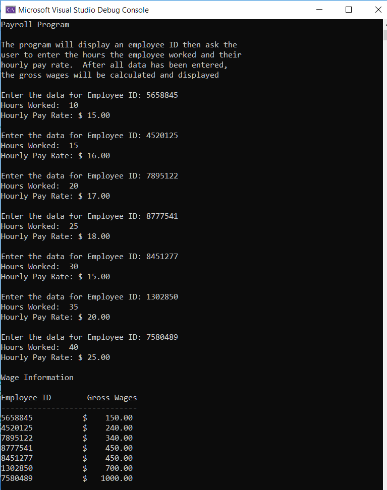
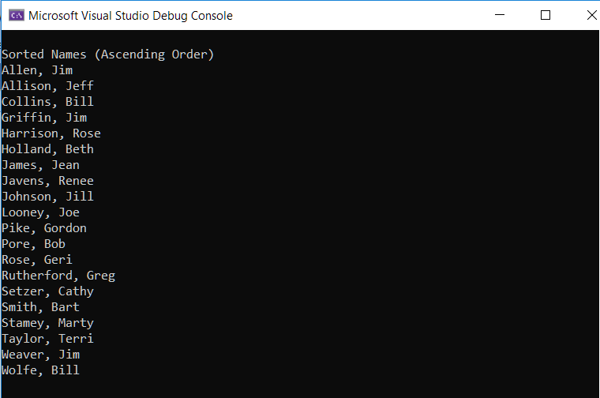
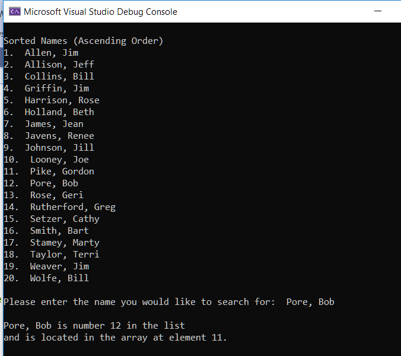

# Final_Project_Cpp-Semester_1
C++ Final Projects Semester 1

### Part 1 Payroll
Payroll program with four arrays to hold employee ID, hours worked, pay rate, and gross wages.  The gross wages will be calculated using pay rate and hours worked.

The program will display an employee ID then ask the user to enter the hours the employee worked and their hourly pay rate.  After all data has been entered, the gross wages will be calculated and displayed.

### Part 2 - Selection Sort A
String Selection Sort

### Part 2 - Selection Sort Search B
Binary String Search

